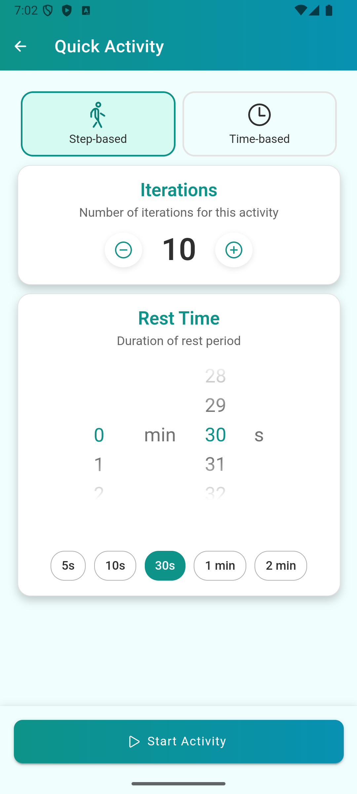
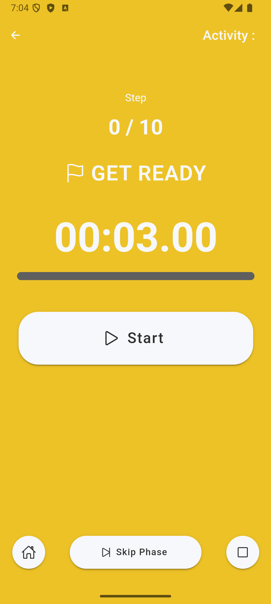
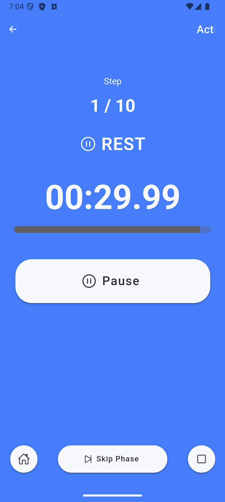
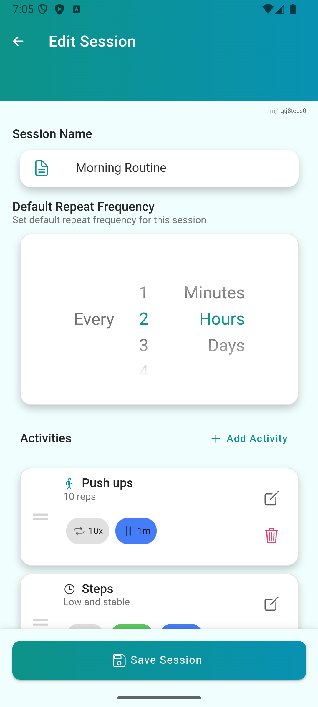
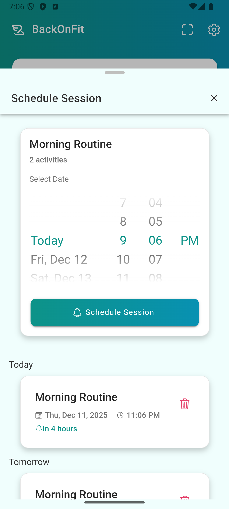
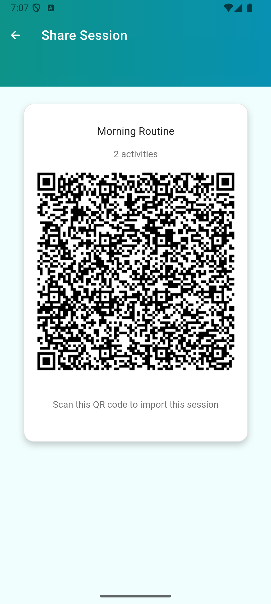

# BackOnFit

An app to support people trying to do more sports or going through a physiotherapy.

## Installation

### Android
You can download the latest APK from the [releases page]().

To install the APK, you need to allow installation from unknown sources in your device settings. 
Then, simply open the downloaded APK file and follow the instructions.

### iOS
The app is not available on the App Store yet.

### From source
You can also build the app from source. The app is build using [Capacitor](https://capacitorjs.com/) and [Ionic Framework](https://ionicframework.com/).
To build the app, you need to have [Node.js](https://nodejs.org/) and [Ionic CLI](https://ionicframework.com/docs/cli) installed.

Then, clone the repository and run the following commands:

```bash
npm install
ionic build
npx cap add android
npx cap sync
npx cap run android
```

## Features

The app is designed over two main concepts:

### Activities

An activity is a short, timed exercise. There is two types of activities:

- **Time-based**: which swings between rest time and effort time for a given number of rounds.
- **Step-based**: which counts how many effort steps you have done, with a rest time in between.

You can create your own activities quickly using the configuration interface:

Once created, the activity starts by alterning between effort and rest periods, with audio/vibration cues to guide you
through the exercise:




### Sessions
A session is a registered set of activities. Users can create their own sessions and play the activities 
sequentially.


Sessions can be scheduled in advance (either directly from the home menu, or after completing a session). If so,
the app will notify the user when it's time to do the session.



### Sharing
Registered sessions can be shared between users ! To do so, click on the share button on the session card. This will
display a QR code that can be scanned by another user to import the session in their app.



## Contributing
I made this app in my free time, to help me recover from a broken ankle. I am not a professional developer, so any 
help or advice is welcome ! If you want to contribute, please fork the repository and make a pull request with your changes.

You can also open an issue if you find a bug or have a feature request !

My main guidelines for this app are:
- **Completely offline**: no tracking, no ads, all data is stored locally on the device.
- **Do not annoy the user**: minimal permissions, no unnecessary notifications. I want to avoid the "Duolingo" effect at all costs.
- **Remain simple**: there already exists complex fitness apps with advanced tracking features, session building, etc. I don't want to compete with them, I just want a simple app to help me do my exercises.
- **Open source**: the code is available on GitHub for anyone to inspect, modify or improve.


## License
